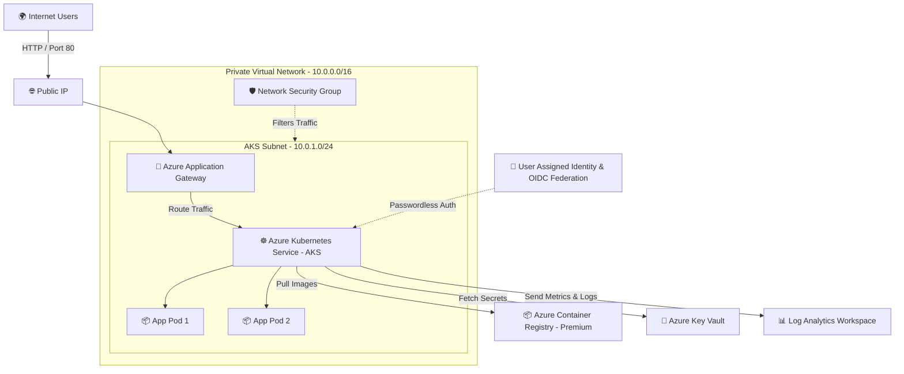

# 🚀 Enterprise Azure AKS Infrastructure with Terraform

[](https://www.terraform.io/)
[](https://azure.microsoft.com/)
[](https://kubernetes.io/)
[](#-architecture-diagram)

> **Welcome!** This project automates the provisioning of a secure, production-ready **Azure Kubernetes Service (AKS)** environment using **Terraform (Infrastructure as Code)**.

---

## 📖 What is this Project? (In Simple Words)

Imagine building a modern, super-secure digital factory:
- You need land with boundary walls and gates (**Networking & Security**).
- You need a dedicated manager and secure rooms (**Resource Groups**).
- You need an automated assembly line of workers running applications (**AKS Cluster**).
- You need a safe locker for passwords and certificates (**Azure Key Vault**).
- You need CCTV cameras monitoring every corner (**Log Analytics**).
- You need a reception desk managing all visitors (**Application Gateway**).

Instead of clicking hundreds of buttons manually in the Azure Portal, this project writes **code (Terraform)** to build all of this in just a few minutes automatically!

---

## 🏛️ Real-World Component Breakdown

| Azure Service | Real-Life Analogy | What It Does in Our Project |
| :--- | :--- | :--- |
| **Resource Group (`rgss`)** | 📦 Container Box | Organizes and groups all cloud resources in a single region. |
| **Virtual Network (`vnt`) & Subnet (`sbnt`)** | 🏡 Boundary Wall & Rooms | Creates an isolated private network so no unauthorized person can enter. |
| **Network Security Group (`nsgg`)** | 👮 Security Guard | Firewall rules that inspect incoming and outgoing traffic. |
| **Azure Kubernetes Service (`kbcl`)** | 🏭 The Digital Factory | The core engine running Docker containerized applications with auto-scaling. |
| **Azure Container Registry (`contrg`)** | 📦 Secure Warehouse | Stores your private application container images safely with geo-replication. |
| **Azure Key Vault (`keyv`)** | 🔐 Bank Locker / Safe | Stores sensitive secrets, API keys, and connection strings securely. |
| **Application Gateway (`appg`)** | 🚪 Reception Desk / Load Balancer | Distributes website visitors smoothly across servers with high availability. |
| **Log Analytics (`mntr`)** | 📹 CCTV & Health Monitor | Collects performance logs, diagnostics, and system health alerts. |
| **Managed Identity (`uai`, `fic`)** | 🪪 Smart ID Card | Allows AKS to talk to Key Vault & ACR securely **without hardcoded passwords**. |

---

## 📐 Architecture Diagram



---

## 📁 Repository Structure

We follow the **Parent-Child Module Architecture** recommended by HashiCorp:

```text
azure-aks-infrastructure/
│
├── child-modules/               # 🧩 Reusable independent components
│   ├── aks/                     # AKS cluster creation module
│   ├── application-gateway/     # Ingress & Public IP module
│   ├── container-registry/      # ACR registry with georeplication
│   ├── identity/                # Managed Identity & RBAC role assignments
│   ├── key-vault/               # Azure Key Vault module
│   ├── monitoring/              # Log Analytics Workspace module
│   ├── networking/              # VNet, Subnet, and NSG module
│   └── resource-group/          # Azure Resource Group module
│
├── project/
│   └── aks-infrastructure/      # 🚀 Root / Parent Module (Orchestrator)
│       ├── main.tf              # Calls and wires all child modules together
│       ├── variable.tf          # Variable definitions
│       ├── providers.tf         # AzureRM provider configuration
│       ├── data.tf              # Reads Azure client & tenant context
│       ├── terraform.tfvars.example  # 📋 Sample configuration template
│       └── terraform.tfvars     # 🔒 Actual secrets & inputs (Git-ignored)
│
├── .gitignore                   # 🛡️ Prevents committing credentials & states
└── README.md                    # 📘 Project documentation
```

### Why Child & Parent Modules?
- **Reusability**: Each child module can be tested and reused across different projects (Dev, Staging, Prod).
- **Maintainability**: Changes in Key Vault do not break AKS configuration.
- **Clean Separation of Concerns**: Infrastructure logic is decoupled from input variables.

---

## 🔒 Security Best Practices Implemented

1. **Zero Hardcoded Secrets**: Real variable files (`*.tfvars`) are strictly **git-ignored** to prevent leaking Azure subscription IDs or passwords to GitHub.
2. **Passwordless Authentication**: AKS utilizes **Azure Workload Identity (`fic`)** and **User-Assigned Managed Identity (`uai`)** using OIDC federation rather than service principal passwords.
3. **Network Isolation**: The AKS cluster and Application Gateway reside inside a dedicated **Virtual Network** protected by **Network Security Groups (NSG)**.
4. **Geo-Replication**: Azure Container Registry is configured with premium geo-replication and zone redundancy for enterprise resilience.

---

## 🚀 How to Deploy (Step-by-Step)

### Prerequisites
Make sure you have installed:
- [Azure CLI](https://learn.microsoft.com/en-us/cli/azure/install-azure-cli)
- [Terraform CLI (>= 1.5.0)](https://developer.hashicorp.com/terraform/downloads)

### 1. Clone the Repository
```bash
git clone https://github.com/Vinayakgaur221/azure-aks-infrastructure.git
cd azure-aks-infrastructure/project/aks-infrastructure
```

### 2. Login to your Azure Account
```bash
az login
az account set --subscription "<YOUR-SUBSCRIPTION-ID>"
```

### 3. Create your `terraform.tfvars` from Example Template
Copy the sanitized sample file and customize it with your values:
```bash
cp terraform.tfvars.example terraform.tfvars
```
Edit `terraform.tfvars` and replace `<YOUR_AZURE_SUBSCRIPTION_ID>` with your real Azure Subscription ID.

### 4. Initialize Terraform
Downloads the required `azurerm` provider plugins and connects modules:
```bash
terraform init
```

### 5. Preview Planned Changes
View all resources that Terraform will create in Azure:
```bash
terraform plan
```

### 6. Apply & Provision Infrastructure
Deploy everything onto Microsoft Azure:
```bash
terraform apply
```

---

## 🧹 How to Clean Up (Avoid Azure Costs)

When you are done testing, destroy all resources with a single command:
```bash
terraform destroy
```